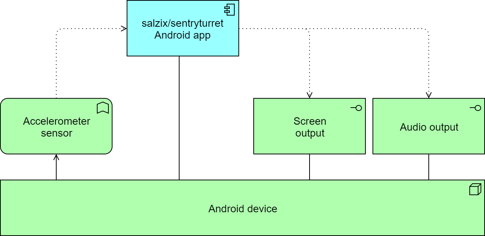

# What it is
Android application displaying "eye" of Sentry Turret from Portal game.
It is very early WIP project.

Primary purpose of this project is to learn Android and JAVA development.
Secondary - to connect to SBrick device used with Lego Technic and make an android device an decision center. It should use all necessary sensors to get input data required to make a decision and to control Lego Technic vehicle.

# Current version
* displays "eye"
* says greeting when touched
* says activation phrase when started
* uses Android accelerometer sensor to detect pick up and says some phrases
* "eye" reacts to audo output and enlarges pupil

#Current architecture

